# :sparkles:File Encryption System Based on OpenPGP

## **How to run** :question:

-   Clone the repository, build and run with VS2019 or higher
-   Install using [installer](https://www.truemogician.com:1926/openpgp-installer.exe), if your operating system is Windows 7 or higher. Note that this ClickOnce application lacks security authentication, thus the download and installation will be blocked, thus you need to proceed at your own risk. But I can assure you this software is harmless.

## **How it works** :question:

-   Authentication
    
    
-   Encryption & Decryption
    
    
